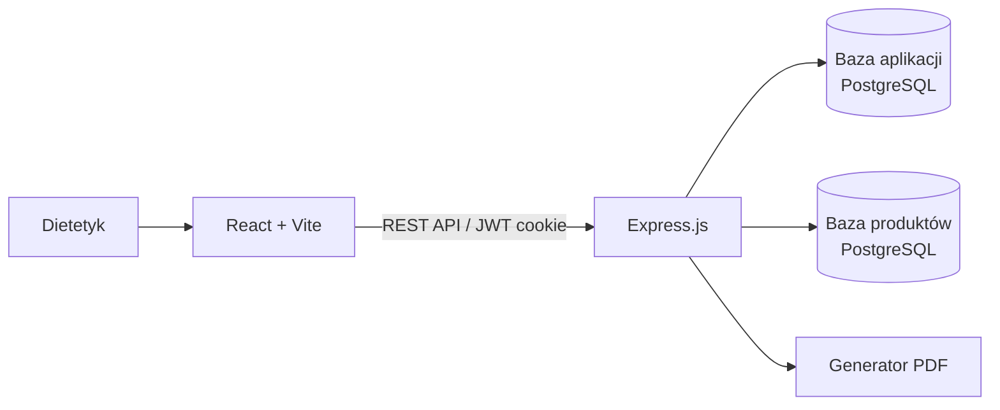

# Dietetyk System

**Aplikacja webowa wspierająca dietetyków w zarządzaniu pacjentami i tworzeniu spersonalizowanych planów żywieniowych.**

[](https://react.dev/)
[](https://expressjs.com/)
[](https://www.postgresql.org/)
[](https://docs.docker.com/compose/)

Projekt inżynierski rozwijany jako pełny system klient-serwer. Łączy zarządzanie danymi pacjentów, analizę zapotrzebowania energetycznego oraz interaktywny kreator jadłospisów korzystający z bazy wartości odżywczych produktów.

## Najważniejsze możliwości

- zarządzanie profilami pacjentów, ich danymi zdrowotnymi i historią pomiarów,
- obliczanie wskaźników **BMI**, **BMR** i **TDEE**,
- tworzenie wielodniowych planów żywieniowych z podziałem na posiłki,
- wyszukiwanie produktów i automatyczne podsumowanie kalorii oraz makroskładników,
- uwzględnianie schorzeń i alergii pacjenta podczas pracy nad jadłospisem,
- zapisywanie wersji roboczej planu w `localStorage`,
- prowadzenie notatek oraz monitorowanie postępów pacjenta,
- eksport gotowego planu żywieniowego do pliku PDF,
- rejestracja i logowanie dietetyka z użyciem JWT.

## Co pokazuje projekt

Projekt obejmuje cały przepływ tworzenia aplikacji webowej: od zaprojektowania interfejsu i logiki domenowej, przez REST API i relacyjną bazę danych, po konteneryzację środowiska.

Szczególnie istotne elementy techniczne:

- frontend zbudowany w React z routingiem, loaderami i actions z React Router,
- rozbudowany stan kreatora planu zarządzany przez `useReducer`,
- REST API w Express z podziałem na routing, kontrolery, middleware i serwisy,
- autoryzacja JWT przechowywana w ciasteczku `httpOnly` z flagą `sameSite=strict`,
- hashowanie haseł za pomocą `bcrypt`,
- parametryzowane zapytania SQL do PostgreSQL,
- dwie niezależne bazy danych: dane aplikacji oraz katalog produktów,
- generowanie dokumentów PDF po stronie backendu przy użyciu `pdf-lib`,
- izolacja usług i komunikacja między nimi przez sieci Docker Compose.

## Architektura



Środowisko składa się z czterech kontenerów:

| Usługa | Odpowiedzialność |
|---|---|
| `frontend` | interfejs użytkownika i komunikacja z API przez proxy Vite |
| `backend` | logika biznesowa, autoryzacja, REST API i generowanie PDF |
| `db-app` | użytkownicy, dietetycy, pacjenci, pomiary, notatki i plany |
| `db-products` | produkty oraz ich wartości odżywcze |

## Stack technologiczny

| Obszar | Technologie |
|---|---|
| Frontend | React 19, React Router 7, Vite, CSS Modules |
| Backend | Node.js, Express 5, JWT, bcrypt, pdf-lib |
| Dane | PostgreSQL 15, SQL |
| Infrastruktura | Docker, Docker Compose |

## Uruchomienie lokalne

### Wymagania

- Docker i Docker Compose,
- pliki inicjalizujące schematy baz danych w katalogu `db/`,
- plik `products.csv` z katalogiem produktów.

Skopiuj przykładową konfigurację i uzupełnij własne hasła oraz sekret JWT:

```bash
cp .env.example .env
```

Następnie uruchom wszystkie usługi:

```bash
docker compose up --build
```

Aplikacja będzie dostępna pod adresem [http://localhost:5173](http://localhost:5173).

## Struktura repozytorium

```text
.
├── backend/
│   ├── src/
│   │   ├── controllers/   # obsługa żądań i logika biznesowa
│   │   ├── middleware/    # autoryzacja
│   │   ├── routes/        # endpointy REST API
│   │   ├── services/      # generowanie PDF i pobieranie danych planów
│   │   └── utils/         # walidacja i funkcje pomocnicze
│   └── server.js
├── frontend/
│   └── src/
│       ├── api/           # komunikacja z backendem
│       ├── components/    # komponenty współdzielone
│       ├── pages/         # widoki aplikacji
│       └── utils/         # kalkulatory BMI, BMR i TDEE
└── docker-compose.yml
```

## Status projektu

Projekt jest aktywnie rozwijany w ramach pracy inżynierskiej. Obecna wersja realizuje główny przepływ pracy dietetyka: od rejestracji pacjenta i analizy jego danych, przez przygotowanie jadłospisu, po eksport planu do PDF.

Planowany dalszy rozwój obejmuje testy automatyczne, rozszerzenie walidacji danych oraz dopracowanie wdrożenia produkcyjnego.
